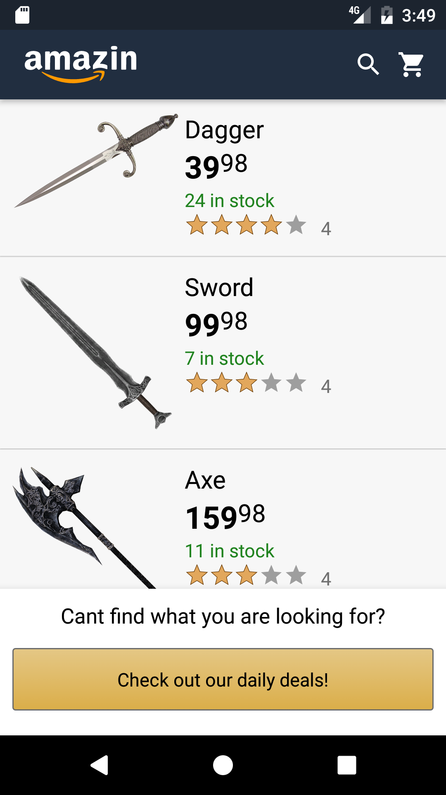
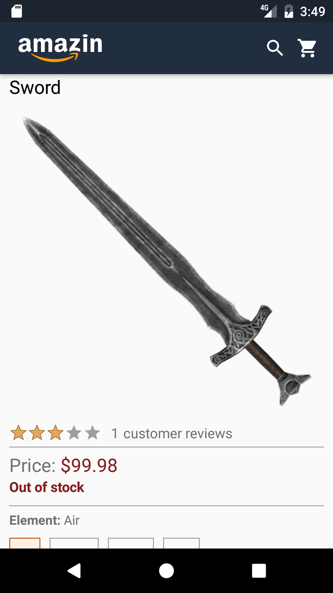
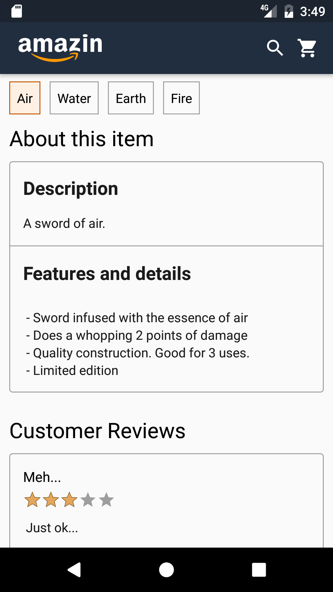
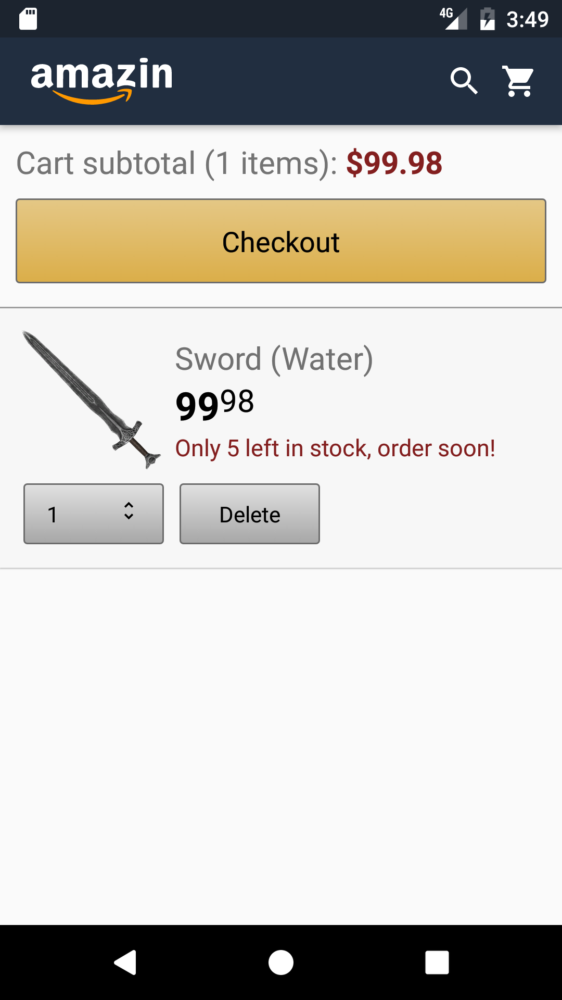
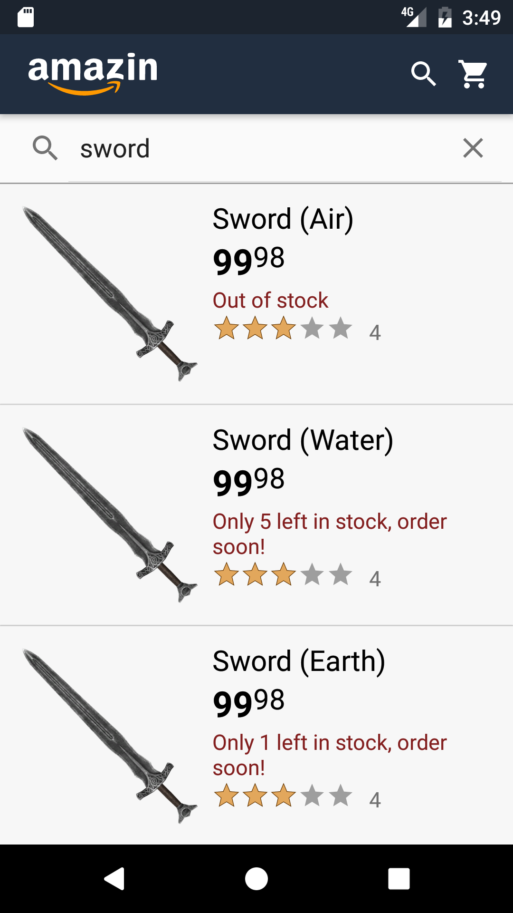
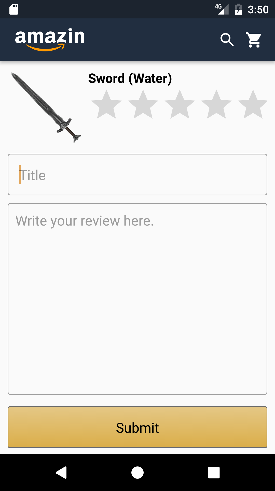

## Overview

This app is an aspect of a larger game I want to make.

The game is a memory/guessing game where you have to buy the right weapons with the right attributes to fight monsters. Certain monsters are only vulnerable to certain weapon types or elements. And the user must remember the monster's weaknesses and buy new items accordingly.

This app as it stands, covers the store and buying aspect of the game.

## Screenshots

   

  

## App features

- The app works very similar to Amazon. (I copied a lot of elements from the Amazon UI)
- User can view items in the store.
- Add items to cart, delete items in cart or checkout
- Search for items by name and type
- See and read comments and ratings left by others
- Write his/her comments.

## Programming structure

- The app relies very heavily on databases
- There are three main database "weapons", "weapon_types" and "elements" that supply the "store" with the items it needs
- The databases are connected by foreign keys
- This app uses activities mostly with animations turned off to accomadate a professional "store" app, and allows it to run smoothly

## Copyright issues

- Most of the item pictures for this app was taken off the internet.
- I copied the aethetic and UI of the amazon app and website. I did NOT copy any of their images, but made my own logo.

## Future plans

- I will be making the "Game" aspect of the app
- That aspect WILL have a lot more animations and cool stuff
- I will be migrating the database to the cloud, or maybe use an API of some sort to get a list of weapons
- As weapon lists grow, I will be implementing a filter function

## Known issues

- Picasso reloads everytime the recyclerview adds or deletes views. I need to add some logic to prevent this
- In the item detail view, the selection boxes look different depending on the version of Android. 
